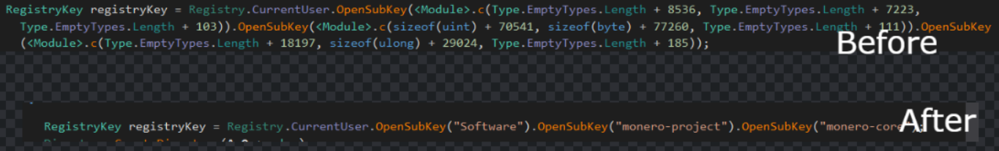

# deGremlin
##### A tool to decrypt and patch strings obfuscated with Appfuscator. Tested on Gremlin Stealer.


# USAGE

````

       __          ______                              __    _
      |  ]       .' ___  |                            [  |  (_)
  .--.| | .---. / .'   \_| _ .--.  .---.  _ .--..--.   | |  __   _ .--.
/ /'`\' |/ /__\\| |   ____[ `/'`\]/ /__\\[ `.-. .-. |  | | [  | [ `.-. |
| \__/  || \__.,\ `.___]  || |    | \__., | | | | | |  | |  | |  | | | |
 '.__.;__]'.__.' `._____.'[___]    '.__.'[___||__||__][___][___][___||__]
                                                                        P.S: little bit Appfuscator

Usage:
degremlin.exe [filepath] [method_token_in_hex]
````


# Example
##### This is from the Gremlin Stealer sample



# IT DOES
- [x] Patch most obfuscated strings
- [x] Simplify Addition and XOR mixed boolean arithmetic
- [x] Eliminate sizeof's
- [x] Eliminate EmptyType


# TO-DO
- [ ] Patch terneary operator
- [ ] Cover more patterns


